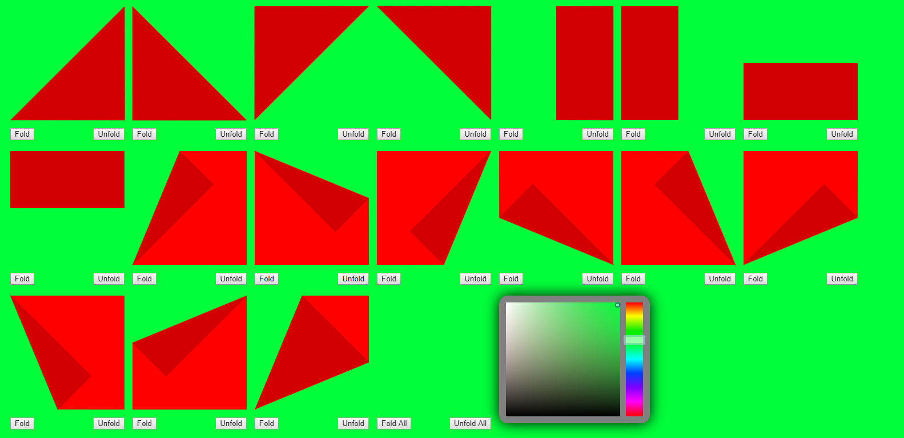

Name: Joseph Morris
Date: 06/15/2016

[Click here for live demo!](http://themanysidesof.me/demo/CSS-Origami/ "Click here for live demo!")

# Note:
This code has not been edited or maintained since it was written. It serves as an example of my ongoing explorations in coding.

# Description:
This is a quick experiment in using CSS 3D transforms, transitions, and animation. It utilizes vector images to give the illusion that elements are being folded, as if they were sheets of origami paper. It is done in such a way that the content behind the fold is not affect, which is demonstrated by changing the background color of the screen.
